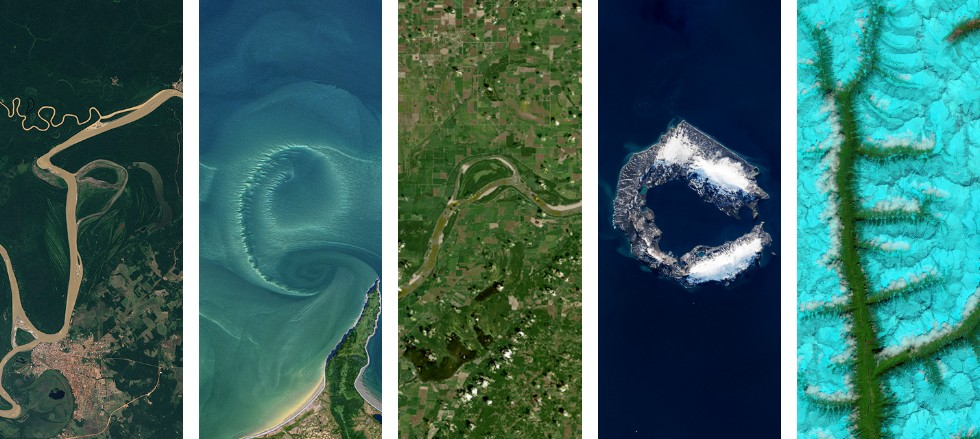

{.site-banner fig-alt="Banner image"}

::: {.hero}

::: {.hero-text}
# Peleg Kremer
::: {.title-line}
Associate Professor of Geography and the Environment &nbsp;·&nbsp; Villanova University
:::

::: {.lead}
Spatial analysis for just and sustainable urban social-ecological systems. My lab uses GIS, remote sensing, and machine learning to understand how the structure and governance of cities shape who experiences environmental burdens and who receives environmental benefits, with a focus on urban heat, air quality, flooding, green stormwater infrastructure, and equitable access to green space in Philadelphia and beyond.
:::

::: {.button-row}
[Research](research.qmd){.btn-quiet}
[Publications](publications.qmd){.btn-quiet .outline}
[CV](cv.qmd){.btn-quiet .outline}
:::
:::

::: {.hero-portrait-wrap}
{.hero-portrait fig-alt="Portrait of Peleg Kremer"}
:::

:::

::: {.eyebrow}
Active funded research
:::

::: {.grants-strip}

::: {.grant-card}
::: {.funder}
NSF SCC-IRG · Track 1
:::
::: {.title}
Integrating Community Dynamics, Environmental Data, and AI to Advance Green Stormwater Infrastructure Sustainability
:::
::: {.meta}
Co-PI · 2024 to 2028
:::
:::

::: {.grant-card}
::: {.funder}
NSF DISES
:::
::: {.title}
Abating Mobility Equity Gaps Induced by Nuisance Flooding in Underserved Communities
:::
::: {.meta}
Co-PI · 2024 to 2028
:::
:::

::: {.grant-card}
::: {.funder}
William Penn Foundation
:::
::: {.title}
Beyond Land Precarity: Building a Garden Database and Platform to Support Philadelphia Growers
:::
::: {.meta}
PI · 2025 to 2027
:::
:::

:::

::: {.eyebrow}
What is new
:::

::: {.news-strip}
- ::: {.date}
  2026 · Apr
  :::
  Three Kremer-lab papers at the AAG annual meeting in San Francisco: [PGDC's approach to urban garden preservation](projects/pgdc.qmd), [measuring community garden security in Philadelphia](projects/pgdc.qmd), and PM2.5 and chronic disease across 500 US cities.

- ::: {.date}
  2026 · Mar
  :::
  [*Sensitivity of urban structure-temperature relationships to grid parameterization*](https://doi.org/10.1016/j.ecoinf.2025.103587) out in **Ecological Informatics** with Dennis Weaver and Justin Stewart.

- ::: {.date}
  2025 · Oct
  :::
  WPF Webinar with Craig Borowiak: [*Roots at Risk: How Secure are Philadelphia Urban Gardens?*](https://vimeo.com/1129186476)

- ::: {.date}
  2025 · Jul
  :::
  Began as Associate Editor of [**Sustainable Cities and Society**](https://www.sciencedirect.com/journal/sustainable-cities-and-society).

- ::: {.date}
  2024 · Dec
  :::
  [*Unequal access to social, environmental and health amenities in US urban parks*](https://doi.org/10.1038/s44284-024-00153-2) published in **Nature Cities** (Winkler, Clark, Locke, Kremer et al.).
:::

[See all news](news.qmd){.btn-quiet .outline}

::: {.eyebrow}
Research themes
:::

::: {.theme-grid}

::: {.theme-card}
::: {.funder-tag}
STURLA
:::
### [Urban structure and environmental conditions](projects/ues.qmd)
How the three-dimensional structure of cities, the way buildings, vegetation, and pavement combine at the block scale, shapes the heat, air quality, and ecological processes residents experience.
:::

::: {.theme-card}
::: {.funder-tag}
Green infrastructure
:::
### [Green stormwater infrastructure](projects/gsi-nsf.qmd)
Integrating spatial data with AI and community knowledge to plan, evaluate, and improve GSI in ways that are effective and equitable.
:::

::: {.theme-card}
::: {.funder-tag}
Urban flooding
:::
### [Mobility and nuisance flooding](projects/dises-nsf.qmd)
How chronic, low-grade flooding restructures everyday mobility and access to opportunity in underserved communities.
:::

::: {.theme-card}
::: {.funder-tag}
Community gardens
:::
### [Philadelphia Garden Data Collaborative](projects/pgdc.qmd)
A long-term partnership with civic organizations to protect community gardens through spatial data, monitoring, and policy translation.
:::

::: {.theme-card}
::: {.funder-tag}
Cross-cutting
:::
### [Environmental justice and amenity access](projects/ej-amenities.qmd)
Why access to nature in the city remains unequal, and what spatial frameworks could change that.
:::

:::
