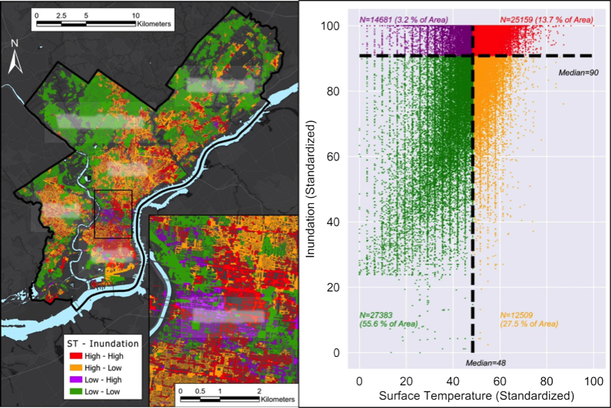
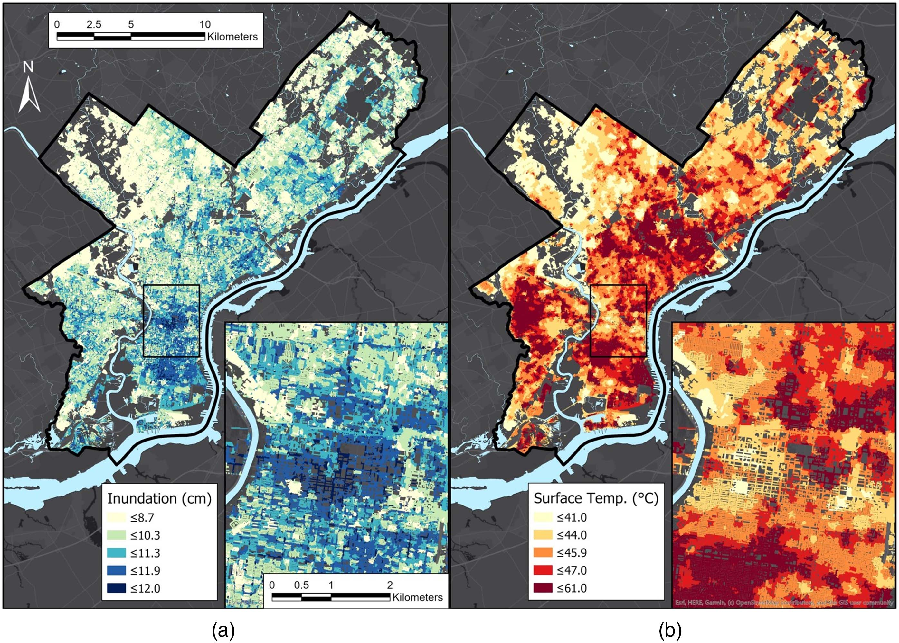

::: {.project-meta}
::: {}
::: {.label}
Funder
:::
NSF DISES
:::
::: {}
::: {.label}
Period
:::
2024 to 2028
:::
::: {}
::: {.label}
My role
:::
Co-PI
:::
::: {}
::: {.label}
Team
:::
Ermagun & Xiong (Co-PIs), Smith, Kremer, Wadzuk (Supporting), Levy (Co-PI)
:::
:::

{fig-alt="Integrated runoff, heat, and social vulnerability map"}

## The question

Nuisance flooding (chronic, low-grade flooding from drainage failure, sea level rise, and intense precipitation) is increasingly common in US cities, but its everyday consequences for the people who live with it are poorly understood. How does this kind of flooding restructure mobility, access to opportunity, and exposure to risk in underserved communities, and how can transportation and stormwater planning be reoriented to close those gaps?

## What this project does

A Dynamics of Integrated Socio-Environmental Systems (DISES) award combining transportation engineering, civil engineering, geography, and community partners. My lab contributes the geospatial analysis of flood-mobility coupling and the equity framing that connects environmental exposure to mobility disruption. Field sites include Philadelphia neighborhoods with documented nuisance-flooding histories.

{fig-alt="Urban runoff modeling result"}

## Key publications

- Ermagun, A., Janatabadi, F., Safarloo, Z., Kremer, P., Lindley, S. (2026). Urban flooding restructures mobility through coupled behavioral and network disruption: a systematic review of evidence. *Sustainable Cities and Society*, 107285.
- Marks, N. K., Hosseiny, H., Bill, V. P., Ahn, K. L., Crimmins, M. C., Kremer, P., Smith, V. B. (2022). Spatial integration of urban runoff modeling, heat, and social vulnerability for blue-green infrastructure planning and management. *Journal of Water Resources Planning and Management*, 148(11).

## Students currently working on this project

Tefera Shibeshi · Prottoy Roy · Emily Myers
