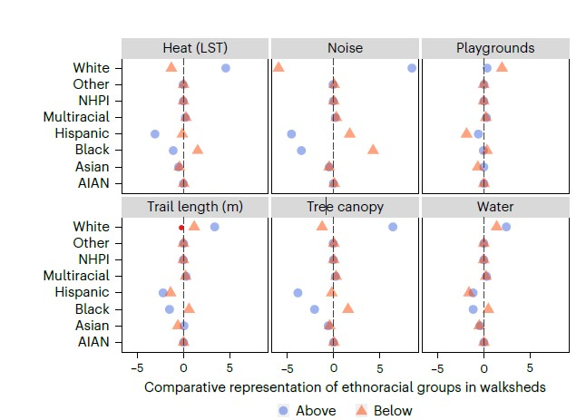
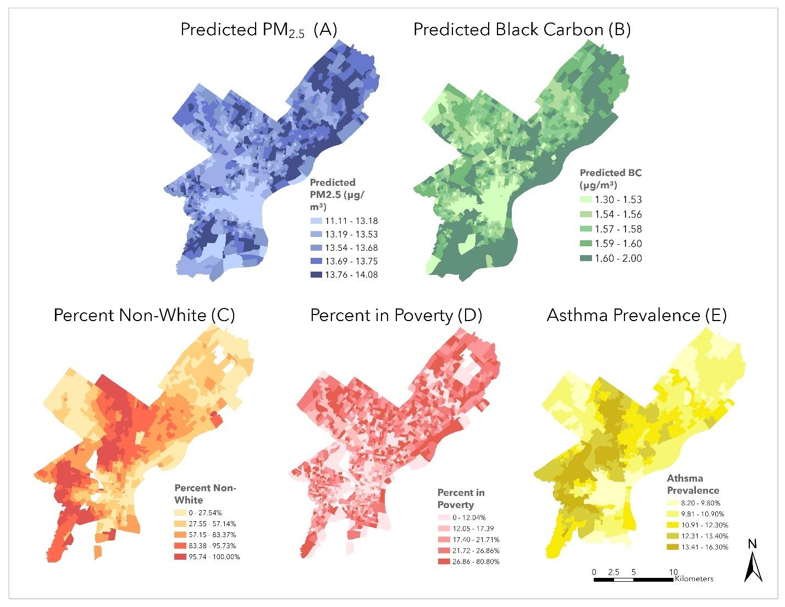

::: {.project-meta}
::: {}
::: {.label}
Program of work
:::
2013 to present
:::
::: {}
::: {.label}
Key vehicle
:::
SESYNC "Parks for People" research pursuit
:::
::: {}
::: {.label}
Lead collaborators
:::
Lepczyk, Aronson, Pearsall, Locke, Clark, Winkler, Vargo, Lerman, Nilon, Hoover, Joo, Lee, La Rosa, Larson
:::
:::

{fig-alt="Park amenity inequality across US cities"}

## The question

Urban green spaces, parks, and environmental amenities are unequally distributed within and across US cities, often along lines of race, income, and historical disinvestment. Why does access to nature in the city remain so unequal, and what spatial frameworks could change that?

## What we do

This program combines conceptual synthesis with empirical work. Earlier papers articulated the apparent paradox between urban greening and social inclusion (Haase et al. 2017, *Habitat International*) and made the case for centering equity in urban ecosystem services research (Kremer et al. 2016, *Ecology and Society*). Through the SESYNC "Parks for People" research pursuit, the collaboration has been producing a sequence of empirical papers on park access:

- **National scale.** Winkler, Clark, Locke, Kremer et al. (2024, *Nature Cities*) examines unequal access to social, environmental, and health amenities in US urban parks, showing that disparities are not only about whether parks exist but about what they contain.
- **Park quality measurement.** Lee et al. (2024, *Landscape and Urban Planning*) reviews park-quality measurement instruments and proposes directions for the next generation of tools.
- **Human–nature interactions.** Joo, Clark, Kremer, Aronson (2024, *Urban Ecosystems*) examines socio-environmental drivers of human–nature interactions in urban green spaces.
- **Local grounding.** Scolio, Bohra, Kremer, Shakya (2024, *Atmosphere*) maps fine-scale particulate air pollution disparities in Philadelphia onto historical patterns of redlining and disinvestment.

{fig-alt="PM2.5 air pollution and redlining overlay"}

## Key publications

- Winkler, R. L., Clark, J. A., Locke, D. H., Kremer, P., Aronson, M. F., Hoover, F.-A., Joo, H. E., La Rosa, D., Lee, K. J., Lerman, S. B., Pearsall, H., Vargo, T. L., Nilon, C. H., Lepczyk, C. A. (2024). Unequal access to social, environmental and health amenities in US urban parks. *Nature Cities*, 1(12), 861-870.
- Lee, K., Aronson, M. F. J., Clark, J. A. G., Hoover, F.-A., Joo, H. E., Kremer, P., La Rosa, D., Larson, K. L., Lepczyk, C. A., Lerman, S. B., Locke, D. H., Nilon, C. H., Pearsall, H., Vargo, T. L. V. (2024). Limitations of existing park quality instruments and suggestions for future research. *Landscape and Urban Planning*, 249, 105127.
- Joo, H. E., Clark, J. A., Kremer, P., Aronson, M. F. (2024). Socio-environmental drivers of human-nature interactions in urban green spaces. *Urban Ecosystems*, 27(6), 2397-2413.
- Scolio, M., Bohra, C., Kremer, P., Shakya, K. M. (2024). Spatial analysis of intra-urban air pollution disparities through an environmental justice lens: a case study of Philadelphia, PA. *Atmosphere*, 15(7), 755.
- Haase, D., Kabisch, S., Haase, A., Andersson, E., Banzhaf, E., Baró, F., Brenck, M., Fischer, L. K., Frantzeskaki, N., Kabisch, N., Krellenberg, K., Kremer, P., Kronenberg, J., Larondelle, N., Mathey, J., Pauleit, S., Ring, I., Rink, D., Schwarz, N., Wolff, M. (2017). Greening cities – to be socially inclusive? About the alleged paradox of society and ecology in cities. *Habitat International*, 64, 41-48.
- Kremer, P., Hamstead, Z. A., McPhearson, T. (2013). A social-ecological assessment of vacant lots in New York City. *Landscape and Urban Planning*, 120, 218-233.

## Data and code

Winkler, R. L., Clark, J. A. G., Locke, D. H., Kremer, P., Aronson, M. F. J., Hoover, F.-A., Joo, H. E., La Rosa, D., Lee, K. J., Lerman, S. B., Pearsall, H., Vargo, T. L. V., Nilon, C. H., Lepczyk, C. A. (2025). Data and code for analyzing unequal access to social, environmental, and health amenities in United States urban parks. Forest Service Research Data Archive. USDA Forest Service. [DOI](https://doi.org/10.2737/rds-2024-0039)
