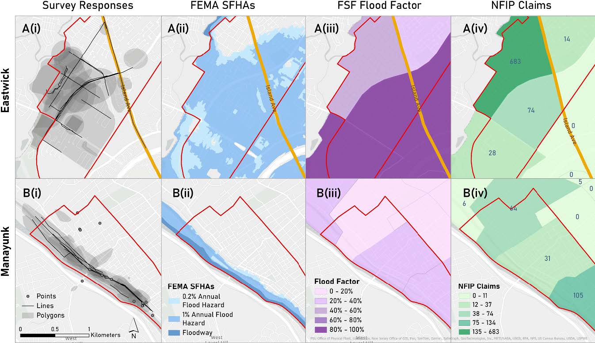
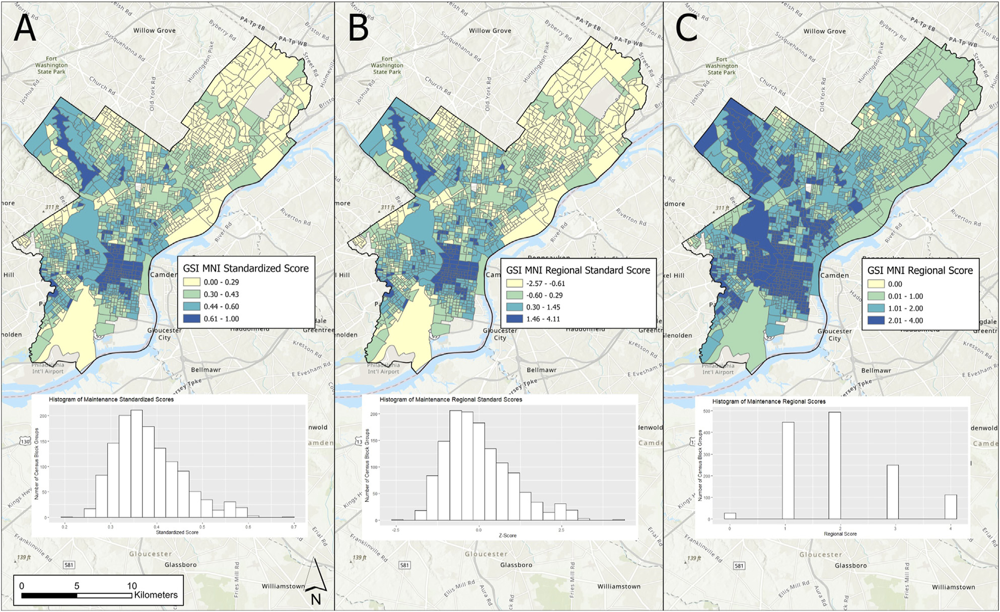
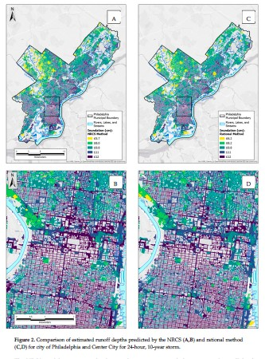

{fig-alt="Community-informed flood map of Philadelphia"}

::: {.lead}
Urban flooding is becoming more frequent and severe under climate change. Its consequences are borne unevenly: low-lying, historically disinvested neighborhoods are flooded more often, recover more slowly, and have less voice in the planning systems that decide where stormwater infrastructure goes. My lab works with civil engineering colleagues at Villanova and transportation researchers to ask how cities can use spatial data, community knowledge, and AI to plan flood mitigation, green stormwater infrastructure (GSI), and adaptation strategies that are both effective and equitable.
:::

> How can cities plan flood adaptation that is both effective and equitable?

## What we do

Three interconnected lines of work:

- **Equitable GSI planning and performance.** Where rain gardens, bioswales, and green roofs should go, why they often underperform once installed, and how performance varies with maintenance, site conditions, and the social context they sit in.
- **Community-informed flood modeling.** Who counts as flood-prone depends on how you measure flooding. Incorporating lived experience and community stormwater knowledge changes which neighborhoods get identified as at-risk, and it changes the maps planners use.
- **Flooding, mobility, and access to opportunity.** Chronic, low-grade nuisance flooding restructures how people move through cities and reach jobs, care, and services. We are modeling those disruptions and the equity gaps they produce.

{fig-alt="Map of GSI maintenance vulnerability in Philadelphia"}

## Active funded projects

**NSF SCC-IRG Track 1: Integrating Community Dynamics, Environmental Data, and AI to Advance Green Stormwater Infrastructure Sustainability.** Co-PI with Smith (PI, Villanova Civil and Environmental Engineering), Jiao, and Wadzuk. 2024 to 2028. Builds an AI-supported decision framework for GSI siting, maintenance, and performance that integrates engineering, environmental, and community data.

**NSF DISES: Abating Mobility Equity Gaps Induced by Nuisance Flooding in Underserved Communities.** Co-PI with Ermagun (PI, George Mason University) and Xiong (PI, Villanova), Smith, and Wadzuk. 2024 to 2028. A coupled human-natural systems study of how nuisance flooding disrupts mobility and access in vulnerable communities, and how adaptation strategies can close those gaps.

**NSF CDS&E: AI for Sustainable and Fair Green Stormwater Infrastructure Deployment.** Co-PI with Smith (PI). 2022 to 2025. Methodological foundation for the larger SCC-IRG award; developed AI-based approaches to identify equitable siting strategies for GSI.

**NSF SCC Planning Grant: Community Dynamics and GSI.** Co-PI with Smith (PI). 2022 to 2023. Built the interdisciplinary team and conceptual framework that became the SCC-IRG award.

## Featured publications

Selected papers; the full list is on the [Publications](../publications.qmd) page.

- Scolio, M., Kremer, P., Smith, V., Amur, A., Wadzuk, B., Homet, K., Devlin, E., Al Mehedi, M. A., Moore, L. (2025). Delineating urban flooding when incorporating community stormwater knowledge. *Environmental Research: Infrastructure and Sustainability*, 5(1), 015008. [DOI](https://doi.org/10.1088/2634-4505/adad11) [EJ]{.ej-tag}

  *Shows that incorporating community knowledge fundamentally changes which neighborhoods get identified as flood-prone, and argues for a rethinking of how flood risk is mapped.*

- Scolio, M., Amur, A., Olson, E., Smith, V., Wadzuk, B., Homet, K., Devlin, E., Kremer, P. (2025). Reconceptualizing urban flood modeling: toward intersectional and equitable urban flood risk planning. *Sustainable Cities and Society*, 130, 106578. [DOI](https://doi.org/10.1016/j.scs.2025.106578) [EJ]{.ej-tag}

  *Argues for an intersectional approach to flood-risk planning that bridges community legacies with future climate change. Companion to the community-knowledge paper.*

- Ermagun, A., Janatabadi, F., Safarloo, Z., Kremer, P., Lindley, S. (2026). Urban flooding restructures mobility through coupled behavioral and network disruption: a systematic review of evidence. *Sustainable Cities and Society*, 107285. [Link](https://www.sciencedirect.com/science/article/pii/S2210670726001721)

  *Sets the agenda for the DISES project by synthesizing what is known about how flooding reshapes urban mobility.*

- Rahman, M., Smith, V. B., Kremer, P., Wadzuk, B. M., Jiao, X., Amur, A., Arabi, S. (2026). Incorporating artificial intelligence into the future of stormwater management. *Discover Water*.

  *Maps where AI methods can and cannot productively contribute to stormwater management, framing the SCC-IRG research agenda.*

- Al Mehedi, M. A., Smith, V., Kremer, P. (2025). A comparative analysis of urban and peri-urban flood identification using SAR imagery. *PLOS Water*, 4(9), e0000269. [DOI](https://doi.org/10.1371/journal.pwat.0000269)

  *Methodological advance in remote sensing of floods across urban-rural gradients.*

- Marks, N. K., Hosseiny, H., Bill, V. P., Ahn, K. L., Crimmins, M. C., Kremer, P., Smith, V. B. (2022). Spatial integration of urban runoff modeling, heat, and social vulnerability for blue-green infrastructure planning and management. *Journal of Water Resources Planning and Management*, 148(11). [EJ]{.ej-tag}

  *Integrated runoff, heat, and social vulnerability framework. An early synthesis paper that anchors the program.*

{fig-alt="Urban runoff modeling framework"}

## Current team

- **Madeline Scolio** – equitable flood-risk modeling and community stormwater knowledge.
- **Achira Amur** – machine learning for green stormwater infrastructure performance.
- **Tefera Shibeshi** – modeling of urban nuisance flooding.
- **Prottoy Roy** – spatiotemporal modeling of nuisance flood risk.
- **Charles Wildonger** – heavy metal contamination and transport in green stormwater infrastructure.
- **Mac Sanders** – human activity and social context around GSI sites in Kensington.

See the [Students](../students.qmd) page for the full list.

## Partners and collaborators

Drs. Virginia Smith, Bridget Wadzuk, Kelly Good, Robert Traver, and Chenfeng Xiong, Villanova (Center for Resilient Water Systems and Civil and Environmental Engineering); Dr. Alireza Ermagun, George Mason University; Dr. Sarah Lindley, University of Manchester; and the Philadelphia Water Department and other municipal partners.
