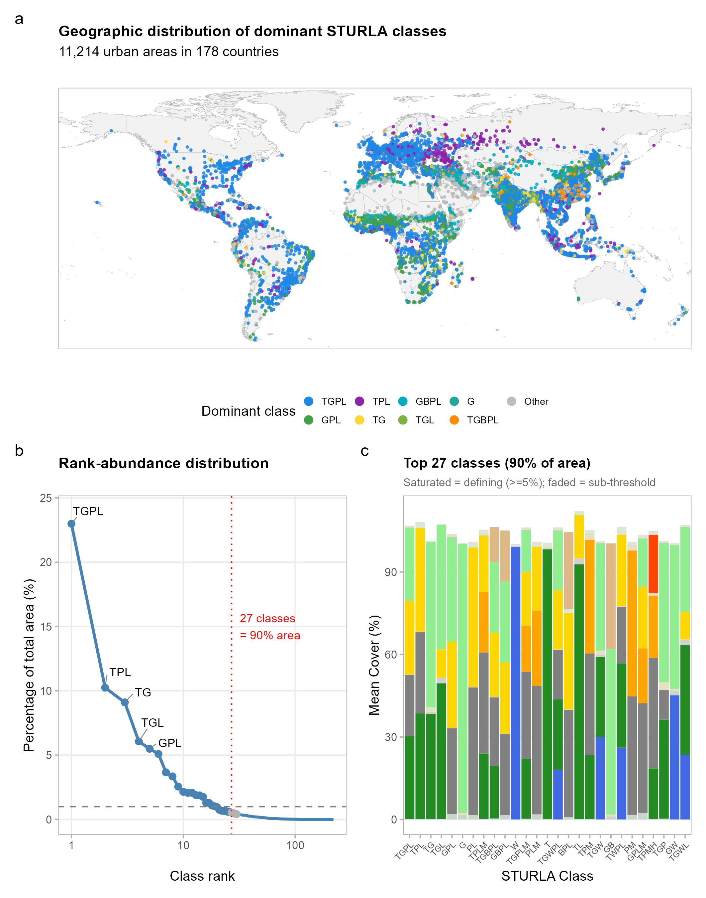
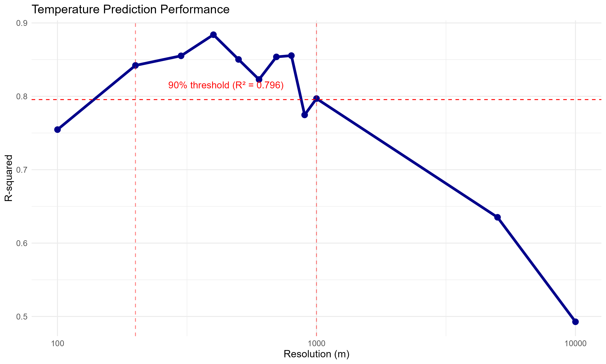
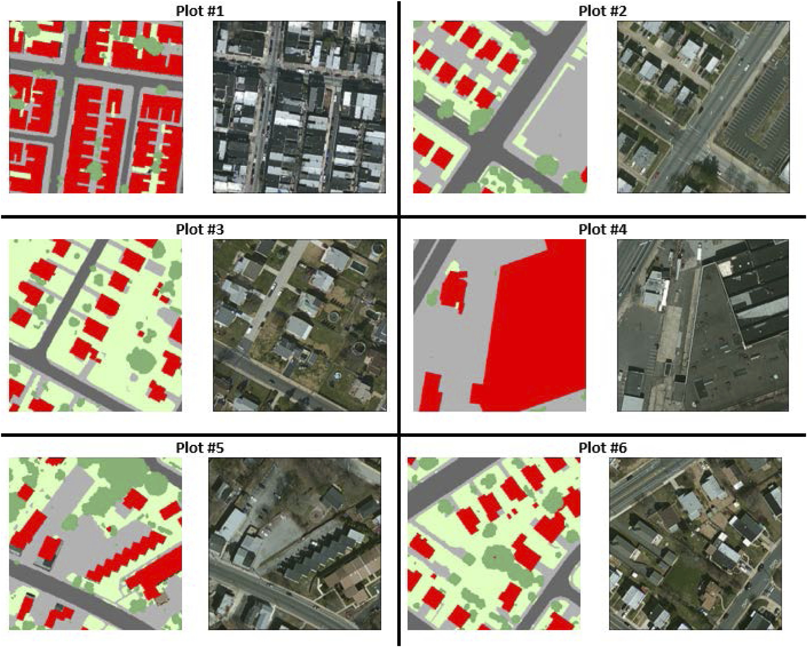
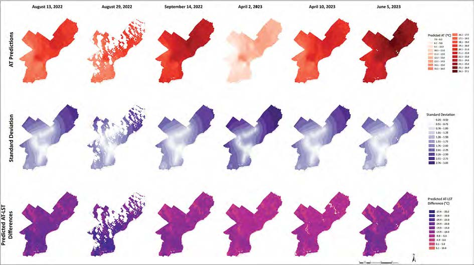

{fig-alt="World map of urban structure classes"}

::: {.lead}
How does the way buildings, vegetation, and pavement combine at the block scale shape what residents breathe and the heat they experience? Most analyses of urban environments rely on flat, two-dimensional land cover and miss the vertical dimension entirely. With colleagues in Berlin, Leipzig, and Philadelphia, my lab developed the Structure of Urban Landscapes (STURLA) classification to capture three-dimensional urban form, and we now use it across cities to ask how composition shapes temperature, air quality, and ecological function.
:::

## What we do

Three interconnected lines of work:

- **Three-dimensional classification of urban form.** The STURLA classification captures common compositions of buildings, vegetation, and pavement at the block scale. It was developed through a Berlin–New York City comparison, refined for New York City, extended to Philadelphia, and now applied via Google Earth Engine to more than 11,000 urban areas worldwide.
- **Urban form and the heat people experience.** We link the structure of city blocks to surface and air temperature, including work that bridges remotely sensed surface temperature to the air temperature residents actually feel, and work that quantifies how the choice of analysis grid shapes conclusions.
- **Fine-scale urban air pollution.** With Dr. Kabindra Shakya in my department, we built a mobile platform for monitoring air and noise pollution in Philadelphia neighborhoods, and use it to study how pollution exposure varies with urban form and along lines of environmental justice.

## Funding

**NSF Geography and Spatial Sciences: Multi-Dimensional Structure of Urban Landscape and the Supply and Distribution of Ecosystem Services.** PI, with Shakya. 2018 to 2024. Established and extended the STURLA framework and the mobile air pollution monitoring program in Philadelphia.

## Figure gallery

Click any figure to enlarge.

::: {layout-ncol=2}

{.gallery-thumb fig-alt="R-squared vs grid size analysis"}

{.gallery-thumb fig-alt="STURLA classes and surface temperature in Philadelphia"}

{.gallery-thumb fig-alt="Surface vs. air temperature"}

{.gallery-thumb fig-alt="PM2.5 and redlining overlay"}

:::

## Featured publications

Selected papers; the full list is on the [Publications](../publications.qmd) page.

- Kremer, P. Urban structure shapes land surface temperature: evidence from a global analysis of urban areas. *Urban Climate* (in review).

  *Applies STURLA via a Google Earth Engine pipeline to 11,214 urban areas across 178 countries, testing whether case-study temperature patterns generalize worldwide.*

- Kremer, P., Weaver, D., Stewart, J. D. (2026). Sensitivity of urban structure-temperature relationships to grid parameterization. *Ecological Informatics*, 93, 103587. [DOI](https://doi.org/10.1016/j.ecoinf.2025.103587)

  *Tests 399 grid configurations and shows that grid size, not orientation, drives results, with implications for any analysis that relies on gridded urban data.*

- Scolio, M., Kremer, P., Zhang, Y., Shakya, K. M. (2024). Spatial-temporal modeling of the relationship between surface temperature and air temperature in metropolitan urban systems. *Urban Climate*, 55, 101921. [DOI](https://doi.org/10.1016/j.uclim.2024.101921)

  *Bridges remotely sensed surface temperature to human-relevant air temperature, opening a path to use globally available remote sensing for urban heat exposure assessment.*

- Scolio, M., Bohra, C., Kremer, P., Shakya, K. M. (2024). Spatial analysis of intra-urban air pollution disparities through an environmental justice lens: a case study of Philadelphia, PA. *Atmosphere*, 15(7), 755. [DOI](https://doi.org/10.3390/atmos15070755)

  *Maps fine-scale particulate air pollution disparities in Philadelphia onto historical patterns of redlining and disinvestment.*

- Hamstead, Z. A., Kremer, P., Larondelle, N., McPhearson, T., Haase, D. (2016). Classification of the heterogeneous structure of urban landscapes (STURLA) as an indicator of landscape function applied to surface temperature in New York City. *Ecological Indicators*, 70, 574-585. [DOI](https://doi.org/10.1016/j.ecolind.2015.10.014)

  *Establishes the STURLA methodology and links it to surface temperature in New York City.*

- Mitz, E., Kremer, P., Larondelle, N., Stewart, J. D. (2021). Structure of urban landscape and surface temperature: a case study in Philadelphia, PA. *Frontiers in Environmental Science*, 9. [DOI](https://doi.org/10.3389/fenvs.2021.592716)

  *Extends STURLA to Philadelphia and links three-dimensional urban structure to surface temperature at the block scale.*

- Shakya, K. M., Kremer, P., Henderson, K., McMahon, M., Peltier, R. E., Bromberg, S., Stewart, J. (2019). Mobile monitoring of air and noise pollution in Philadelphia neighborhoods during summer 2017. *Environmental Pollution*, 255, 113195. [DOI](https://doi.org/10.1016/j.envpol.2019.113195)

  *Demonstrates the mobile monitoring platform for capturing fine-scale variation in air and noise pollution across the city.*

